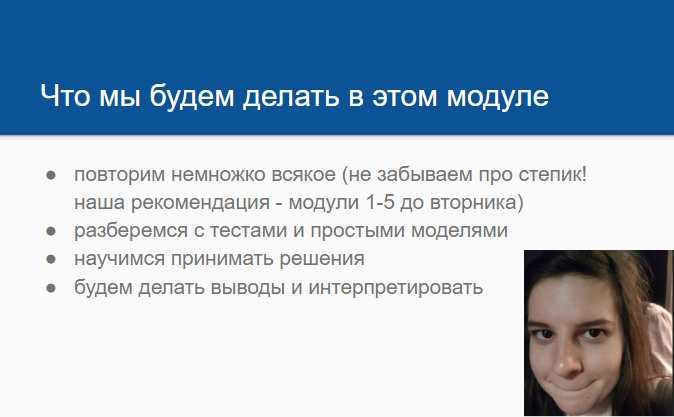
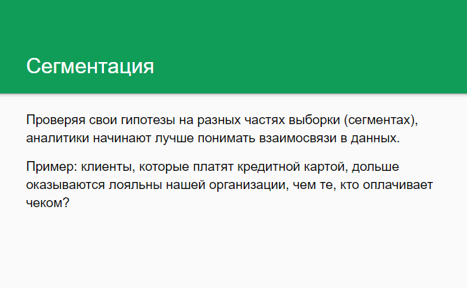
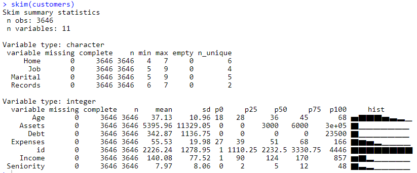

 

На этом занятии мы с вами будем делать клиентские отчеты, научимся создавать читаемые таблицы и отчеты. По ходу пары переносите удачные моменты (картинки, таблицы) в шаблон report-template.Rmd

Начнем с того, что загрузим пакеты и данные. Какие данные у нас есть? 
```{r}
library(dplyr) 
library(readr)
library(ggplot2)
library(magrittr)

customers <- read_csv("~/shared/minor2_2018/1-intro/lab08-segmentation/customers.csv") 

dim(customers)
str(customers, max.level = 1)
```

Есть полезный пакет для описательной статистике по данным -- skimr. Он работает долго, поэтому сейчас мы посмотрим сразу на результат функции skim(). А дома вы можете поэксперементировать со своими данными.
```{r}
library(skimr)
#skim(customers)
```




## Наши клиенты -- кто они?
Постройте ряд графиков, чтобы ответить на этот вопрос

#### Демографические характеристики клиентов

Как распределен возраст наших клиентов? Нарисуйте гистограмму, посчитайте средний и медианный возраст.
```{r}
customers <- read_csv("~/shared/minor2_2018/1-intro/lab08-segmentation/customers.csv") 
```

```{r}
customers %>% ggplot()+ 
  geom_histogram(aes(Age)) + 
  geom_vline(aes(xintercept = mean(Age))) + 
  geom_vline(aes(xintercept = median(Age)))+
  xlab("Age")+
  ylab("Frequency")+
  ggtitle("Age of customers")+
  theme_bw()

```

Добавьте на гистограмму заливку по семейному статусу. 

```{r}
customers %>% ggplot()+ 
  geom_histogram(aes(Age, fill = Marital)) + 
  geom_vline(aes(xintercept = mean(Age))) + 
  geom_vline(aes(xintercept = median(Age)))+
  xlab("Age")+
  ylab("Frequency")+
  ggtitle("Age of customers")+
  theme_bw()
```

Сделайте таблицу в которой будет подсчитан средний и медианный возраст клиентов для каждого семейного статуса.

```{r}
customers %>% group_by(Marital) %>% summarise(mean_age = mean(Age), median_age = median(Age))
```

Нарисуйте распределение клиентов по типу владения жильем (переменная Home). 

```{r}
ggplot(customers)+
  geom_bar(aes(Home))+
  ylab("Frequency")+
  xlab("Home")+
  ggtitle("Distribution of clients")

```

Посчитайте какой процент наших клиентов владеет каждым типом жилья.

```{r}

customers %>% group_by(Home) %>% summarise(Percent = n()/nrow(customers)*100)

```

Удалите из базы всех клиентов у которых тип жилья ignor, other или priv

```{r}
customers <- read_csv("~/shared/minor2_2018/1-intro/lab08-segmentation/customers.csv") 
customers = customers %>% filter(!(Home %in% c("ignor", "other", "priv")))

```

#### Зарплата и расходы

Как связана заработная плата и тип занятости? Нарисуйте, который показал бы медианную зарплату по типу занятости и сделайте аналогичню таблицу.

```{r}
t = customers %>% group_by(Job) %>% summarise(median_income = median(Income))
ggplot(t)+geom_bar(aes(Job, median_income), stat = "identity")+theme_bw()+ggtitle("Job and income relation")+ylab("Average income")
t
```

Нарисуйте еще одну гистограмму распределения возраста клиентов. Однако, в этот раз заливкой столбиков отобразите тип занятости. В какой возрастной группе больше всего людей имеют неполную занатость?

```{r}
ggplot(customers)+
  geom_histogram(aes(Age, fill = Job))+
  ggtitle("Distribution of customer's age")+
  ylab("Frequency")+
  xlab("Age")+
  theme_bw()
customers %>% filter(Job == "partime") %>% group_by(Age) %>% summarise(count = n()) %>% arrange(-count)
```

Нарисуйте график показывающий связь заработной платы и расходов.

```{r}
ggplot(customers)+
  geom_point(aes(Income, Expenses))+
  ggtitle("Income and expenses relation")+
  theme_bw()
```

Отличаются ли расходы у людей с разным семейным статусом? Какая категория тратит больше всего?

```{r}
customers %>% group_by(Home) %>% summarise(Expenses = sum(Expenses))
```

Высчитайте переменную Savings, отражающую ежегодные сбережения, т.е. количество денег, которые человек ежегодно сохраняет или недосчитывается. Вычите расходы из доходов.

```{r}
customers = customers %>% mutate(Savings = Income - Expenses)
```

У клиентов с каким семейным статусом и типом занятости медианные сбережения больше всего?

```{r}
customers %>% group_by(Home, Job) %>% summarise(Savings = median(Savings)) %>% arrange(-Savings)
```

#### Активы и долги

Также в данных есть информация о текущих долгах клиента и его вложених. 

Создайте новый датафрейм, в котором будут только записи о тех клиентах, у которых есть долг. В этой части анализировать эту подвыборку.

```{r}
data1 = customers %>% filter(Debt > 0)
```

У клиентов с каким семейным статусом долги больше? 

```{r}
data1 %>% group_by(Home) %>% summarise(debt = mean(Debt)) %>% arrange(-debt)
```

Зависит ли как-то рабочий стаж (Seniority) и текущая задолженность?

```{r}
data1 %>% group_by(Seniority) %>% summarise(sum_debt = sum(Debt)) %>% ggplot()+
  geom_line(aes(Seniority, debt))
```

### Отчет. Часть 1 -- клиентская база
Перенесите наиболее красивые и содержательные картинки и таблицы в файл credit-template.Rmd


## Making new buisness -- с чем связана выплата кредита? 
На этом этапе мы знаем все о наших клиентах. Предположим, что мы хотим внедрить новый элемент в наш бизнес -- мы выдаем кредиты. И хотим все сделать максимально эффективно, то есть прибыльно.

Для пробы мы дали кредит первым нескольким тысячам обратившихся к нам клиентов. 

В теперь давайте выясним, как связаны уже известные нам переменные с тем выплатит ли клиент кредит или нет!
Сформулируйте гипотезы о связи переменных и постройте необходимые графики или таблицы.

```{r}
#Добавим новую переменную -- Status, в которой записана информация о том, вернул ли клиент кредит или нет. 
credit_data <- read_csv("~/shared/minor2_2018/1-intro/lab08-segmentation/credit-data.csv")
customers <- read_csv("~/shared/minor2_2018/1-intro/lab08-segmentation/customers.csv") 

#соедините таблицы
df = left_join(customers, credit_data)

```

Ваши гипотезы тут!
```{r}
ggplot() + geom_count(data = df, aes(x = Status, Marital))

table(df$Status, df$Marital)

```
```{r}
table(df$Status, df$Home)
table(df$Status, df$Job)

```

### Отчет. Часть 2 -- с чем связана выплата кредита?
Перенесите наиболее интересные гипотезы и результаты в файл credit-template.Rmd

Итоговый отчет пришлите нам в виде гиста с помощью share_report.

