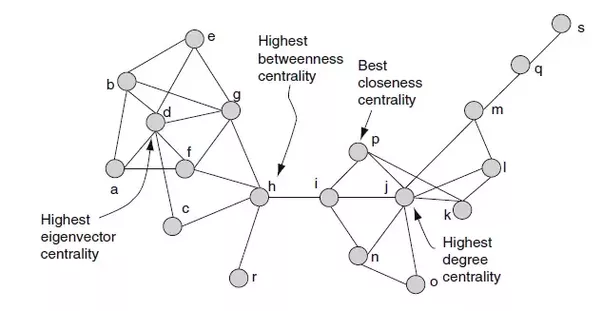

На предыдущем занятии мы поговорили о сетях в целом и посмотрели на свои сети друзей ВК. 

### Рисование графа

В пакете `igraph` много параметров для визуализации графов. Более подробно можно посмотреть в `?igraph.plotting`.

Загрузим опять граф про семьи Флоренции (см. предыдущее занятие)

```{r}
library(readr)
library(igraph)
adjFlorence <- read_csv("~/shared/minor2_2018/2-tm-net/lab01-netIntro/florentineFamily.csv")
rownames(adjFlorence) <- names(adjFlorence)

adjFlorence <- as.matrix.data.frame(adjFlorence)

florentine <- graph_from_adjacency_matrix(adjmatrix = adjFlorence, mode = "undirected")
```

Можно менять цвета, размеры, подписи, фон и т.д., чтобы получить именно тот вид графа, что нужен. Существует два способа определения этих параметров. 

Первый -- указать их в функции `plot`:
```{r}
plot(florentine,
     vertex.color = "lightgreen",
     vertex.size = 40,
     vertex.shape = "square",
     edge.width = 2)
```

Второй способ -- задать нужные значения как свойства вершин или ребер.

```{r}
V(florentine)$name

#проверим до
V(florentine)$color

V(florentine)$color = c(rep("lightblue",8),rep("red",8))

#проверим после
V(florentine)$color

V(florentine)$size = 7
V(florentine)$label.dist = 1 # labels outside the circles
E(florentine)$width = 2
plot(florentine)
# 
V(florentine)$color[9] = "green"
plot(florentine)
```

Еще один параметр визуализации -- укладка (layout)

```{r}
plot(florentine, layout = layout.circle)
plot(florentine, layout = layout.fruchterman.reingold)
plot(florentine, layout = layout.kamada.kawai, 
     vertex.color = "orange",           
     vertex.label.color = "black")

```


### Меры центральности

Не все вершины в сети однаково важны -- какие-то могут быть более влиятельны, какие-то менее. В разных задачах "важность" может пониматься по-разному. 

Например, можно считать в сети друзей важнее того из них, у кого больше друзей ("чем больше связей, тем лучше"). Такой показатель называется **степенью (degree)**. 

Рассмотрим на небольшом примере социальной сети - сети клуба карате (Zachary carate club).

Загрузим данные из пакета igraphdata (здесь цвет -- вручную заданные группы)

```{r message=FALSE}
library(igraph)
library(igraphdata)

data(karate) # loading network from package
```

Посчитаем степень узла

```{r}
V(karate)
degree(karate)

plot(karate, 
     vertex.size = degree(karate)*1.5, 
     vertex.label.cex = degree(karate)/10,
     layout = layout.davidson.harel)
```

Еще одним показателем важности является **центральность по посредничеству, битвинность (betweenness)**. В этом случае важны вершины, которые являются посредниками между группами, находятся на "выгодном" месте.

```{r}
betweenness(karate)

plot(karate, 
     vertex.size = betweenness(karate)/10, 
     vertex.label.cex = betweenness(karate)/150,
     layout = layout.davidson.harel)
```

Если нам интересны вершины с наиболее короткими путями до остальных (т.е. наиболее близкие к остальным), то рассматривается **центральность по близости (closeness)**. 

```{r}
closeness(karate) 
x = closeness(karate)
sort(x, decreasing = T)
plot(karate, 
     vertex.size = closeness(karate)*1500, 
     vertex.label.cex = closeness(karate)*70,
     layout = layout.davidson.harel)
```




### Выявление сообществ (community detection)

Основная идея выделения сообществ -- члены сообщества должны быть больше похожи друг на друга, чем на участников других сообществ (другими словами, число связей между членами одного сообщества должно быть больше, чем число связей между сообществами). 

Метод **edge betweenness**: иерархический метод, состоящий в последовательном удалении связей в порядке убывания показателей битвинности ребер (edge betweenness scores), то есть числа кратчайших путей, проходящих по рассматриваемому ребру.

```{r}
ebcommune <- edge.betweenness.community(karate)
ebcommune
membership(ebcommune) ## assigning nodes to communities
table(membership(ebcommune))
modularity(ebcommune)

plot(ebcommune, karate) 
```

Сколько групп получилось?

#### Другие алгоримы

* **Fast-Greedy**: иерархический подход. Первоначально каждая вершина представляет собой отдельное сообщество. Сообщества объединяются таким образом, чтобы это привело к наибольшему возрастанию модулярности. Останавливаемся, когда нет следующего шага, увеличивающего модулярность. 
Посмотрим на примере семей Флоренции
```{r}
fgcommune <- fastgreedy.community(florentine)
membership(fgcommune) ## assigning nodes to communities
table(membership(fgcommune))
modularity(fgcommune)
plot(fgcommune, florentine)
```

* **Walktrap**: Подход, основанный на случайных путях. Основная идея -- если случайно "блуждать" по графу, то больше шансов, что ваш путь будет чаще оставаться внутри сообщества и только иногда выходить за его пределы. 

```{r}
wtcommune <- walktrap.community(florentine)
wtcommune
membership(wtcommune) ## assigning nodes to communities
modularity(wtcommune)
plot(wtcommune, florentine)
```

Другие алгоритмы в `igraph` (см. справку)

* label.propagation.community 
* leading.eigenvector.community 
* multilevel.community 
* optimal.community
* spinglass.community 
* infomap.community


**Ваша очередь:**

В примере с сетью друзей размер узла определяется битвинностью, а цвета показывают разделение на сообщества методом edge.betweenness.

* *Обратите внимание:* если вы уже создавали свою сеть, то у вас есть файл ~/graph_info.RData. В нем хранятся данные о вашей сети, собранные из ВК, и код сначала проверяет, есть ли такой файл. Поэтому когда вы будете собирать html (кнопка knit), не нужно будет опять ждать окончания скачивания данных.

Исследуйте свою сеть. Какие выводы вы можете сделать?

## Не только описание 

Загрузите данные о переписке в небольшой  IT-компании, проводящей маркетинговые исследования на R. Данные содержат матрицу 17х17 с направленными связями.

* help_seeking.csv -- связь A->B в сети означает, что A отправил запрос B с просьбой проверить код на адекватность, чтобы позднее отправить заказчику.

```{r}
help_seeking <- read.csv("~/shared/minor2_2018/2-tm-net/lab02-centrality-community/help_seeking.csv")
```

Мы можем провести анализ и для этой сети -- посчитать центральности и найти важные вершины, выделить сообщества. Но можно ли узнать что-то еще?

### Ассортативность

Для исследования структурных свойств сетей также можно оценить показатель **ассортативности или гомофилии**, т.е. того, насколько узлы склонны иметь связи с узлами, обладающими сходными свойствами. В этом случае мы уже добавляем в анализ не только сетевые, структурные характеристики (степень, битвинность и т.д.), но и какие-то внешние атрибуты (например, принадлежность к группе)

```{r message=F, warning=FALSE}
library(igraph)
```

Преобразуем сети в igraph объекты

* как из матриц смежности можно получить объекты igraph?

Дополнительно загрузим файл с атрибутами узлов -- attr, включающем имя (name), пол (sex), образование (education), уровень экспертизы (предположим, что знание R сотрудниками компании было зафиксировано и выражено в численной переменной expertise). 

```{r}
g_help_seeking = graph_from_adjacency_matrix(as.matrix(help_seeking))
attr = read.csv("~/shared/minor2_2018/2-tm-net/lab02-centrality-community/attr.csv")

plot(g_help_seeking)
```

Добавим атрибуты к узлам сети
```{r}
V(g_help_seeking)$name
V(g_help_seeking)$expertise = ifelse(V(g_help_seeking)$name %in% attr$name, attr$expertise, 0)
V(g_help_seeking)$expertise

plot(g_help_seeking)
```

Посчитаем коэффициент ассортативности
```{r}
assortativity(g_help_seeking, V(g_help_seeking)$expertise, directed = T)
```

Итак, мы получили коэффициент ассортативности. Он измеряется от -1 до 1, где -1 -- связи в сети склонны формироваться между узлами с отличающимися характеристиками, а 1 -- узлы предпочитают формировать связь с похожими узлами (в нашем случае, похожие по уровню знания R), 0 -- связи формируются без привязки к этой характеристике 

Также можем посчитать ассортативность для категориальной переменной (обратите внимание на название функции)
```{r}
attr_sex = ifelse(V(g_help_seeking)$name %in% attr$name, attr$sex, 0)
levels(attr_sex) = c(1, 0)

V(g_help_seeking)$sex = attr_sex 
assortativity_nominal(g_help_seeking, V(g_help_seeking)$sex, directed = T)

V(g_help_seeking)$color = ifelse(V(g_help_seeking)$sex == 2, "red", "blue") 

plot(g_help_seeking)
RColorBrewer::display.brewer.all()
```

* какие выводы можно сделать?

**Ваша очередь**

Рассмотрим еще одну сеть про сотрудников ИТ-компании

* feedback.csv -- в этой сети связь B->A означает, что B ответил и оставил рецензию на код A.

```{r}
feedback <- read.csv("~/shared/minor2_2018/2-tm-net/lab02-centrality-community/feedback.csv")
rownames(feedback) <- names(feedback)
```

Посмотрите, насколько работники склонны просить рецензии у "равных" по уровню образования 

```{r}
g_feedback = graph_from_adjacency_matrix(as.matrix(feedback))
plot(g_feedback)
g_feedback
V(g_feedback)

E(g_feedback)

plot(g_feedback,
     vertex.color = "lightgreen",
     vertex.size = 10,
     edge.width = 1)

degree(g_feedback)
d = degree(g_feedback)
sum(d>0)

```


```{r}
k = 0
for (i in 1:17){
  for (j in 1:17){
    if (feedback[i,j] == 1 & feedback[j, i] == 1){
      k = k+1
    }
  }
}
k
#result = 8
```


