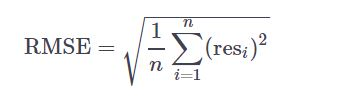

#1. Does your model generalize?
Remember the dataset on GDP per capita and percentage of urban development? You were advised to take the logarithm of GDP per capita. Both the regression line and R2 showed a better result for the log-linear model, lm_wb_log, than for the simple linear model, lm_wb.

You might be wondering whether we were misguiding you and had you produce an overfit? Your workspace contains world_bank_train that you've used before to build the log-linear model. Now, however, also world_bank_test is available. You can use this dataset to test if your model generalizes well.

You'll be comparing the RMSE for both sets:


* The RMSE of the training set, rmse_train is calculated for you. You'll need it later to calculate the ratio between the training and test RMSE.
* The residuals for the test set, res_test, are calculated for you. Try to understand the code here. You first have to find the ground truth labels and then compare them with predictions you made with lm_wb_log.
* Calculate the RMSE for the test set. Assign this to rmse_test.
* Print the ratio of the test's RMSE over the training's RMSE to compare the two.

```{r}
# world_bank_train, world_bank_test and lm_wb_log are pre-loaded

# Build the log-linear model
lm_wb_log <- lm(urb_pop ~ log(cgdp), data = world_bank_train)

# Calculate rmse_train
rmse_train <- sqrt(mean(lm_wb_log$residuals ^ 2))

# The real percentage of urban population in the test set, the ground truth
world_bank_test_truth <- world_bank_test$urb_pop

# The predictions of the percentage of urban population in the test set
world_bank_test_input <- data.frame(cgdp = world_bank_test$cgdp)
world_bank_test_output <- predict(lm_wb_log, world_bank_test_input)

# The residuals: the difference between the ground truth and the predictions
res_test <- world_bank_test_output - world_bank_test_truth


# Use res_test to calculate rmse_test
rmse_test = sqrt(mean(res_test^2))

# Print the ratio of the test RMSE over the training RMSE
rmse_test/rmse_train
```

#2. Your own k-NN algorithm!
In the video, Gilles shortly showed you how to set up your own k-NN algorithm. Now it's time to inspect up close how it works.

We went ahead and defined a function my_knn that contains a k-NN algorithm. Its arguments are:

x_pred: predictor values of the new observations (this will be the cgdp column of world_bank_test),
x: predictor values of the training set (the cgdp column of world_bank_train),
y: corresponding response values of the training set (the urb_pop column of world_bank_train),
k: the number of neighbors (this will be 30).
The function returns the predicted values for your new observations (predict_knn).

You'll apply a k-NN algorithm to the GDP / capita of the countries in world_bank_test to predict their percentage of urban population.

* For the first instruction, you don't have to code anything! Just inspect the my_knn function and try to identify the following steps:
* Calculation of dist, the absolute distance between the new observation and your training sample;
* Calculation of sort_index, the order of dist, using order(); This function returns the indices of elements in dist, in ascending order. So sort_index[1] will return the index of the smallest distance in dist, sort_index[2] the second smallest, ...
* Calculation of predict_knn[i], the mean() of the values in y that correspond to the k smallest distances. Note that sort_index[1:k] will return the indices of the k smallest elements in dist. y contains the percentages of urban population in the training set.
* Apply the algorithm on the test set, using 30 neighbors. Assign the predictions to test_output. If you're not sure which arguments to use, have a look at the description!
* Lastly, have a look at the predicted outcomes. These plots are already coded.

* Call my_knn() with the first two arguments set to world_bank_test$cgdp and world_bank_train$cgdp respectively, the third argument world_bank_train$urb_pop, and the fourth argument 30.


```{r}
###
# You don't have to change this!
# The algorithm is already coded for you;
# inspect it and try to understand how it works!
my_knn <- function(x_pred, x, y, k){
  m <- length(x_pred)
  predict_knn <- rep(0, m)
  for (i in 1:m) {

    # Calculate the absolute distance between x_pred[i] and x
    dist <- abs(x_pred[i] - x)

    # Apply order() to dist, sort_index will contain
    # the indices of elements in the dist vector, in
    # ascending order. This means sort_index[1:k] will
    # return the indices of the k-nearest neighbors.
    sort_index <- order(dist)
    # Apply mean() to the responses of the k-nearest neighbors
    predict_knn[i] <- mean(y[sort_index[1:k]])

  }
  return(predict_knn)
}
###

# world_bank_train and world_bank_test are pre-loaded

# Apply your algorithm on the test set: test_output
test_output = my_knn(world_bank_test$cgdp, world_bank_train$cgdp, world_bank_train$urb_pop, 30)

# Have a look at the plot of the output
plot(world_bank_train,
     xlab = "GDP per Capita",
     ylab = "Percentage Urban Population")
points(world_bank_test$cgdp, test_output, col = "green")
```
#3. Parametric vs non-parametric!
So now you've build three different models for the same data:

a simple linear model, lm_wb,
a log-linear model, lm_wb_log and
a non-parametric k-NN model. This k-NN model is actually simply a function that takes test and training data and predicts response variables on the fly: my_knn().
These objects are all stored in your workspace, as are world_bank_train and world_bank_test.

Have a look at the sample code on the right, which shows the first steps for building a fancy plot. In the end, three lines should be plotted that represent the predicted responses for the test set, together with the true responses.

You'll also calculate the RMSE of the test set for the simple linear, log-linear and k-NN regression. Have a look at the results, which regression approach performs the best?

* Inspect the chunk of code that has already been written for you. Can you tell what it does?
* Similar to the linear model, use predict() and assign this prediction to test_output_lm_log. Next, use lines() to add a "red" line representing the log-linear output. Use the same line width.
* Predict the responses with k-NN and assign the result to test_output_knn, just like you did in the previous exercise. Again using lines(), add a "green" line of width 2 that represents the results of the k-NN algorithm.
* Calculate the RMSE on the test set for the three techniques. The answer for the linear model is already there. Which one give the best results? Does this correspond with the figure you've created?

```{r}
# world_bank_train and world_bank_test are pre-loaded
# lm_wb and lm_wb_log have been trained on world_bank_train
# The my_knn() function is available

# Define ranks to order the predictor variables in the test set
ranks <- order(world_bank_test$cgdp)

# Scatter plot of test set
plot(world_bank_test,xlab = "GDP per Capita", ylab = "Percentage Urban Population")

# Predict with simple linear model and add line
test_output_lm <- predict(lm_wb, data.frame(cgdp = world_bank_test$cgdp))
lines(world_bank_test$cgdp[ranks], test_output_lm[ranks], lwd = 2, col = "blue")

# Predict with log-linear model and add line
lm_wb_log <- lm(urb_pop ~ log(cgdp), data = world_bank_train)
test_output_lm_log = predict(lm_wb_log, data.frame(cgdp = world_bank_test$cgdp))
lines(world_bank_test$cgdp[ranks], test_output_lm_log[ranks], lwd=2, col="red")
# Predict with k-NN and add line
test_output_knn = my_knn(world_bank_test$cgdp, world_bank_train$cgdp, world_bank_train$urb_pop, 30)
lines(world_bank_test$cgdp[ranks], test_output_knn[ranks], lwd=2, col="green")


# Calculate RMSE on the test set for simple linear model
sqrt(mean( (test_output_lm - world_bank_test$urb_pop) ^ 2))

# Calculate RMSE on the test set for log-linear model
res_log = test_output_lm_log - world_bank_test$urb_pop
sqrt(mean(res_log^2))
# Calculate RMSE on the test set for k-NN technique
res_knn = test_output_knn - world_bank_test$urb_pop
sqrt(mean(res_knn^2))
```

