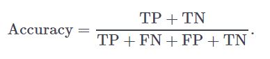

#1. The Confusion Matrix
Have you ever wondered if you would have survived the Titanic disaster in 1912? Our friends from *Kaggle* have some historical data on this event. The *titanic* dataset is already available in your workspace.

In this exercise, a decision tree is learned on this dataset. The tree aims to predict whether a person would have survived the accident based on the variables `Age`, `Sex` and `Pclass` (travel class). The decision the tree makes can be deemed correct or incorrect if we know what the person's true outcome was. That is, if it's a supervised learning problem.

Since the true fate of the passengers, `Survived`, is also provided in titanic, you can compare it to the prediction made by the tree. As you've seen in the video, the results can be summarized in a confusion matrix. In R, you can use the `table()` function for this.

In this exercise, you will only focus on assessing the performance of the decision tree. In chapter 3, you will learn how to actually build a decision tree yourself.

Note: As in the previous chapter, there are functions that have a random aspect. The *set.seed()* function is used to enforce reproducibility. Don't worry about it, just don't remove it!


* Have a look at the structure of titanic. Can you infer the number of observations and variables?

* Inspect the code that build the decision tree, tree. Don't worry if you do not fully understand it yet.

* Use tree to predict() who survived in the titanic dataset. Use tree as the first argument and titanic as the second argument. Make sure to set the type parameter to "class". Assign the result to pred.

* Build the confusion matrix with the table() function. This function builds a contingency table. The first argument corresponds to the rows in the matrix and should be the Survived column of titanic: the true labels from the data. 

* The second argument, corresponding to the columns, should be pred: the tree's predicted labels.


```{r, error=TRUE}
library(readr)
# The titanic dataset is already loaded into your workspace
titanic = read_csv('./dataset/titanic.csv')
# Set random seed. Don't remove this line
set.seed(1)

# Have a look at the structure of titanic
str(titanic)

# A decision tree classification model is built on the data
tree <- rpart(Survived ~ ., data = titanic, method = "class")

# Use the predict() method to make predictions, assign to pred
pred = predict(tree, titanic, type="class")

# Use the table() method to make the confusion matrix
table(titanic$Survived, pred)
```


#2. Deriving ratios from the Confusion Matrix
The confusion matrix from the last exercise provides you with the raw performance of the decision tree:

* 1. The survivors correctly predicted to have survived: true positives (TP)
* 2. The deceased who were wrongly predicted to have survived: false positives (FP)
* 3. The survivors who were wrongly predicted to have perished: false negatives (FN)
* 4. The deceased who were correctly predicted to have perished: true negatives (TN)


The confusion matrix is called `conf`

You saw that these values can be used to estimate comprehensive ratios to asses the performance of a classification algorithm. An example is the accuracy, which in this case represents the percentage of correctly predicted fates of the passengers.



Apart from accuracy, precision and recall are also key metrics to assess the results of a classification algorithm:


The confusion matrix you've calculated in the previous exercise is available in your workspace as conf.


* Assign the correct values of the confusion matrix to FP and TN. Fill in the ___.
* Calculate the accuracy as acc and print it out.

* Finally, also calculate the precision and the recall, as prec and rec. Print out both of them.

```{r, error=TRUE}
library(readr)
titanic = read_csv('./dataset/titanic.csv')
set.seed(1)
tree <- rpart(Survived ~ ., data = titanic, method = "class")
pred = predict(tree, titanic, type="class")
conf = table(titanic$Survived, pred)
# The confusion matrix is available in your workspace as conf
conf
# Assign TP, FN, FP and TN using conf
TP <- conf[1, 1] # this will be 212
FN <- conf[1, 2] # this will be 78
FP <- conf[2, 1] # fill in
TN <- conf[2, 2] # fill in

# Calculate and print the accuracy: acc
acc = (TP + TN)/(TP + TN + FP + FN)
acc

# Calculate and print out the precision: prec
prec = TP/(TP+FP)
prec

# Calculate and print out the recall: rec
rec = TP/(TP+FN)
rec
```


#The quality of a regression

Imagine this: you're working at NASA and your team measured the sound pressure produced by an airplane's wing under different settings. These settings are the frequency of the wind, the angle of the wing, and several more. The results of this experiment are listed in the `air` dataset

Your team wants to build a model that's able to predict the sound pressure based on these settings, instead of having to do those tedious experiments every time.

A colleague has prepared a multivariable linear regression model, `fit`. It takes as input the predictors: wind frequency `(freq)`, wing's angle `(angle)`, and chord's length `(ch_length)`. The response is the sound pressure `(dec)`. All these variables can be found in air.

Now, your job is to assess the quality of your colleague's model by calculating the RMSE:


* Take a look at the structure of `air`. What does it tell you?
* Inspect your colleague's code that builds a multivariable linear regression model based on `air`. Not familiar with multiple linear regression? No problem! It will become clear in chapter 4. For now, you'll stick to assessing the model's performance.
* Use the *predict()* function to make predictions for the observations in the `air` dataset. Simply pass fit to *predict()*; R will know what to do. Assign the result to `pred`.
* Calculate the RMSE using the formula above. yi corresponds to the actual sound pressure of observation i, which is in air$dec. y^i corresponds to the predicted value of observation i, which is in `pred`. Assign the resulting RMSE to `rmse`.
* Print out `rmse`.


```{r}
# The air dataset is already loaded into your workspace
air = read_csv("./dataset/air.csv")
# Take a look at the structure of air
str(air)

# Inspect your colleague's code to build the model
fit <- lm(dec ~ freq + angle + ch_length, data = air)

# Use the model to predict for all values: pred
pred = predict(fit)

# Use air$dec and pred to calculate the RMSE 
rmse = sqrt((1/nrow(air))*sum((air$dec - pred)^2))

# Print out rmse
rmse
```

#4. Adding complexity to increase quality
In the last exercise, your team's model had 3 predictors (input variables), but what if you included more predictors? You have the measurements on free-stream velocity, velocity and suction side displacement thickness, thickness available for use in the air dataset as well!

Adding the new variables will definitely increase the complexity of your model, but will it increase the performance? To find out, we'll take the RMSE from the new, more complex model and compare it to that of the original model.

A colleague took your code from the previous exercise and added code that builds a new extended model, fit2! It's your job to once again assess the performance by calculating the RMSE.

Use the predict() function to make predictions using fit2, for all values in the air dataset. Assign the resulting vector to pred2.
Calculate the RMSE using the formula above. Assign this value to rmse2.
Print rmse2 and compare it with the earlier rmse. What do you conclude?

```{r}
# The air dataset is already loaded into your workspace

# Previous model
fit <- lm(dec ~ freq + angle + ch_length, data = air)
pred <- predict(fit)
rmse <- sqrt(sum( (air$dec - pred) ^ 2) / nrow(air))
rmse

# Your colleague's more complex model
fit2 <- lm(dec ~ freq + angle + ch_length + velocity + thickness, data = air)

# Use the model to predict for all values: pred2
pred2 = predict(fit2)

# Calculate rmse2
rmse2 <- sqrt(sum( (air$dec - pred2) ^ 2) / nrow(air))

# Print out rmse2
rmse2

```

#5. Let's do some clustering!
In the dataset seeds you can find various metrics such as area, perimeter and compactness for 210 seeds. (Source: UCIMLR). However, the seeds' labels were lost. Hence, we don't know which metrics belong to which type of seed. What we do know, is that there were three types of seeds.

The code on the right groups the seeds into three clusters (km_seeds), but is it likely that these three clusters represent our seed types? Let's find out.

There are two initial steps you could take:

Visualize the distribution of cluster assignments among two variables, for example length and compactness.
Verify if the clusters are well separated and compact. To do this, you can calculate the between and within cluster sum of squares respectively.


Take a look at the structure of the seeds dataset.
Extend the plot() command by coloring the observations based on their cluster. Do this by setting the col argument equal to the cluster element of km_seeds.
Print out the ratio of the within sum of squares to the between cluster sum of squares, so WSS/BSS. These measures can be found in the cluster object km_seeds as tot.withinss and betweenss. Is the within sum of squares substantially lower than the between sum of squares?

```{r}
# The seeds dataset is already loaded into your workspace

# Set random seed. Don't remove this line
set.seed(1)

# Explore the structure of the dataset
str(seeds)

# Group the seeds in three clusters
km_seeds <- kmeans(seeds, 3)

# Color the points in the plot based on the clusters
plot(length ~ compactness, data = seeds, col = km_seeds$cluster)

# Print out the ratio of the WSS to the BSS
km_seeds$tot.withinss/km_seeds$betweenss
```


#6. Split the sets
Let's return to the titanic dataset for which we set up a decision tree. In exercises 2 and 3 you calculated a confusion matrix to assess the tree's performance. However, the tree was built using the entire set of observations. Therefore, the confusion matrix doesn't assess the predictive power of the tree. The training set and the test set were one and the same thing: this can be improved!

First, you'll want to split the dataset into train and test sets. You'll notice that the titanic dataset is sorted on titanic$Survived , so you'll need to first shuffle the dataset in order to have a fair distribution of the output variable in each set.

For example, you could use the following commands to shuffle a data frame df and divide it into training and test sets with a 60/40 split between the two.

```{r}
n <- nrow(df)
shuffled_df <- df[sample(n), ]
train_indices <- 1:round(0.6 * n)
train <- shuffled_df[train_indices, ]
test_indices <- (round(0.6 * n) + 1):n
test <- shuffled_df[test_indices, ]
```

Watch out, this is an example of how to do a 60/40 split! In the exercise you have to do a 70/30 split. However, you can use the same commands, just change the numbers!


The first part of the exercise is done for you, we shuffled the observations of the titanic dataset and store the result in shuffled.
Split the dataset into a train set, and a test set. Use a 70/30 split. The train set should contain the rows in 1:round(0.7 . n) and the test set in (round(0.7 * n) + 1):n. The example in the exercise description can help you!
Print out the structure of both train and test with str(). Does your result make sense?


```{r}
# The titanic dataset is already loaded into your workspace
titanic = read_csv("./dataset/titanic.csv")
# Set random seed. Don't remove this line.
set.seed(1)

# Shuffle the dataset, call the result shuffled
n <- nrow(titanic)
shuffled <- titanic[sample(n),]

# Split the data in train and test
train_indices = 1:round(0.7*n)
train = shuffled[train_indices, ]
test_indices = (round(0.7*n) + 1):n
test = shuffled[test_indices, ]

# Print the structure of train and test
str(train)
str(test)
```

#7. First you train, then you test
Time to redo the model training from before. The titanic data frame is again available in your workspace. This time, however, you'll want to build a decision tree on the training set, and next assess its predictive power on a set that has not been used for training: the test set.

On the right, the code that splits titanic up in train and test has already been included. Also, the old code that builds a decision tree on the entire set is included. Up to you to correct it and connect the dots to get a good estimate of the model's predictive ability.

Fill in the ___ in the decision tree model, rpart(...) so that it is learned on the training set.
Use the predict() function with the tree model as the first argument and the correct dataset as the second argument. Set type to "class". Call the predicted vector pred. Remember that you should do the predictions on the test set.
Use the table() function to calculate the confusion matrix. Assign this table to conf. Construct the table with the test set's actual values (test$Survived) as the rows and the test set's model predicted values (pred) as columns.
Finally, print out conf.

```{r}
# The titanic dataset is already loaded into your workspace

# Set random seed. Don't remove this line.
set.seed(1)

# Shuffle the dataset; build train and test
n <- nrow(titanic)
shuffled <- titanic[sample(n),]
train <- shuffled[1:round(0.7 * n),]
test <- shuffled[(round(0.7 * n) + 1):n,]

# Fill in the model that has been learned.
tree <- rpart(Survived ~ ., data = train, method = "class")

# Predict the outcome on the test set with tree: pred
pred = predict(tree, test, type = "class")

# Calculate the confusion matrix: conf
conf = table(test$Survived, pred)

# Print this confusion matrix
conf
```

#8. Using Cross Validation
You already did a great job in assessing the predictive performance, but let's take it a step further: cross validation.

In this exercise, you will fold the dataset 6 times and calculate the accuracy for each fold. The mean of these accuracies forms a more robust estimation of the model's true accuracy of predicting unseen data, because it is less dependent on the choice of training and test sets.

Note: Other performance measures, such as recall or precision, could also be used here.

The code to split the dataset correctly 6 times and build a model each time on the training set is already written for you inside the for loop; try to understand the code. accs is intialized for you as well.
Use the model to predict the values of the test set. Use predict() with three arguments: the decision tree (tree), the test set (test) and don't forget to set type to "class". Assign the result to pred.
Make the confusion matrix using table() and assign it to conf. test$Survived should be on the rows, pred on the columns.
Fill in the ___ in the statement to define accs[i]. The result should be the accuracy: the sum of the diagonal of the confusion matrix divided by the total sum of the confusion matrix.
Finally, print the mean accuracy of the 6 iterations.

```{r}
# The shuffled dataset is already loaded into your workspace

# Set random seed. Don't remove this line.
set.seed(1)

# Initialize the accs vector
accs <- rep(0,6)

for (i in 1:6) {
  # These indices indicate the interval of the test set
  indices <- (((i-1) * round((1/6)*nrow(shuffled))) + 1):((i*round((1/6) * nrow(shuffled))))
  
  # Exclude them from the train set
  train <- shuffled[-indices,]
  
  # Include them in the test set
  test <- shuffled[indices,]
  
  # A model is learned using each training set
  tree <- rpart(Survived ~ ., train, method = "class")
  
  # Make a prediction on the test set using tree
pred  = predict(tree, test, type="class")
  
  # Assign the confusion matrix to conf
conf = table(test$Survived, pred)
  
  # Assign the accuracy of this model to the ith index in accs
  accs[i] <- sum(diag(conf))/sum(conf)
}

# Print out the mean of accs
mean(accs)
```

