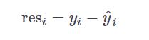
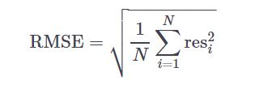
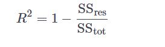
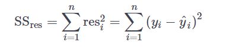
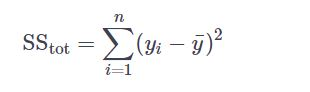

#1. Simple linear regression: your first step!
In your first exercise, you'll familiarize yourself with the concept of simple linear regression. You are given measures of grey kangaroos' nose width and length (Source). You can find the data in kang_nose, which is loaded in your workspace. It has two columns: nose_width and nose_length.

Your job is to describe the linear relationship between the grey kangaroo's nose width (mm) and nose length (mm). Make use of the lm() function as shown in the video and consult the help file if necessary. Remember to explore your data first!

We caught Skippy and measured its nose width, nose_width_new, but it escaped before we measured its nose length, can you help?


* Execute the first line of code to draw a plot and have a look. Is linearity plausible?
* Fill in the ___ in lm() to build a linear model, lm_kang, which models the nose_length by the nose_width variable.
* Return the coefficients of this linear model. You can find it in the coefficients column of lm_kang.
* Finally, use predict() with the lm_kang model as a first argument to predict the nose length corresponding with the nose width in nose_width_new. You can use nose_width_new as the second argument of predict().

```{r}
# The kang_nose dataset and nose_width_new are already loaded in your workspace.

# Plot nose length as function of nose width.
plot(kang_nose, xlab = "nose width", ylab = "nose length")

# Fill in the ___, describe the linear relationship between the two variables: lm_kang
lm_kang <- lm(nose_length ~ nose_width, data = kang_nose)

# Print the coefficients of lm_kang
lm_kang$coefficients

# Predict and print the nose length of the escaped kangoroo
predict(lm_kang, nose_width_new)
```


#2. Performance measure: RMSE
Now that you've got a grasp on the concept of simple linear regression, let's move on to assessing the performance. Let's stick to the Kangaroo example. The dataset, kang_nose, as well as the linear model you built, lm_kang, are available so you can start right away.

In this exercise, you'll plot the regression line through the data points. Next, you'll calculate the residuals,

These are the errors you made by fitting a line through the data points.

Lastly, you'll determine the Root-Mean-Square-Error:


This estimates the standard deviation of the model. Remember, the smaller the RMSE, the better your fit!

```{r}
# kang_nose is pre-loaded in your workspace

# Build model and make plot
lm_kang <- lm(nose_length ~ nose_width, data=kang_nose)
plot(kang_nose, xlab = "nose width", ylab = "nose length")
abline(lm_kang$coefficients, col = "red")

# Apply predict() to lm_kang: nose_length_est
nose_length_est = predict(lm_kang)

# Calculate difference between the predicted and the true values: res
res = kang_nose$nose_length - nose_length_est

# Calculate RMSE, assign it to rmse and print it
rmse = sqrt(mean(res^2))
rmse
```

#2. Performance measures: R-squared
You've correctly calculated the RMSE in the last exercise, but were you able to interpret it? You can compare the RMSE to the total variance of your response by calculating the R2, which is unitless! The closer R2 to 1, the greater the degree of linear association is between the predictor and the response variable.

R calculates these performance measures for you. You can display them by applying summary() to your linear model object. Your job is to now manually calculate R2 and compare your value to the value that R calculated automatically.


Here, SSres is the residual sum of squares,


whereas SStot is the total sum of squares,


with y¯ the sample mean of the response. res, kang_nose and lm_kang are already available in your workspace.

* Calculate SSres -- the sum of the squares of res -- and assign it to ss_res.
* Determine SStot. To compute it, find the difference between the nose_lengths and the average, square those values, and then sum() them. Assign the result to ss_tot.
* Calculate R2, the distance between 1 and ss_res / ss_tot. Assign your outcome to r_sq and print it.
* Call summary() to generate a summary of lm_kang. Take a look at the outcome multiple R-squared.

```{r}
# kang_nose, lm_kang and res are already loaded in your workspace
nose_length = kang_nose$nose_length
# Calculate the residual sum of squares: ss_res
ss_res = sum(res^2)

# Determine the total sum of squares: ss_tot
ss_tot = sum((nose_length - mean(nose_length))^2)
# Calculate R-squared and assign it to r_sq. Also print it.
r_sq = 1 - ss_res/ss_tot
r_sq

# Apply summary() to lm_kang
summary(lm_kang)
```

#3. Another take at regression: be critical
You are given data on GDP per capita and its relation to the percentage of urban population for several UN countries, measured in the year 2014 (Source: The World Bank). This dataset is stored in a data frame world_bank_train and has two variables: cgdp and urb_pop.

Have a look at the data, do you think a relationship between the two is plausible? Try to set up a linear model for the percentage of urban population based on the GDP per capita.

Afghanistan has a GDP per capita of 413 USD, stored in cgdp_afg, but its urban population in 2014 is not known yet. Can you predict the outcome using your model?

Make a scatter plot, using plot(). Is a relation plausible? Is linearity plausible?
Build a linear model, lm_wb, which models the urb_pop by the cgdp variable.

```{r}
# world_bank_train and cgdp_afg is available for you to work with

# Plot urb_pop as function of cgdp
plot(world_bank_train$urb_pop, world_bank_train$cgdp)

# Set up a linear model between the two variables: lm_wb
lm_wb = lm(urb_pop ~ cgdp, world_bank_train)
lm_wb
# Add a red regression line to your scatter plot
abline(lm_wb$coefficients, col = "red")

# Summarize lm_wb and select R-squared
summary(lm_wb)$r.squared
# Predict the urban population of afghanistan based on cgdp_afg
predict(lm_wb, cgdp_afg)
```

#4. Non-linear, but still linear?
In the last exercise, your scatter plot didn't show a strong linear relationship. You confirmed this with the regression line and R2.

To improve your model, take a step back and study the nature of the data. The predictor variable is numerical, while the response variable is expressed in percentiles. It would make more sense if there were a linear relationship between the percentile changes of the GDP / capita and the changes in the response.

To obtain an estimation of percentile changes, take the natural logarithm of the GDP / capita and use this as your new predictor variable. A model solution to the previous exercise is included in the editor; up to you to make some changes.

* Convert the cgdp variable of world_bank_train to log(cgdp) in both plot() and lm().
* Change the xlab argument of plot() to "log(GDP per Capita)". Remember that R is case sensitive!
* Predict the percentage of urban population in Afghanistan again. No need to convert cgdp_afg with log() here, R does this for you.
* Take a look at the plot.

```{r}
# world_bank_train and cgdp_afg is available for you to work with

# Plot: change the formula and xlab
plot(urb_pop ~ log(cgdp), data = world_bank_train,
     xlab = "log(GDP per Capita)",
     ylab = "Percentage of urban population")

# Linear model: change the formula
lm_wb <- lm(urb_pop ~ log(cgdp), data = world_bank_train)

# Add a red regression line to your scatter plot
abline(lm_wb$coefficients, col = "red")

# Summarize lm_wb and select R-squared
summary(lm_wb)$r.squared

# Predict the urban population of afghanistan based on cgdp_afg
predict(lm_wb, cgdp_afg)
```

#5. Going all-in with predictors! (multi-linear model)
In the video, Vincent showed you a multi-linear model for net sales based on advertisement and competition. The dataset is available in your workspace as shop_data.

In this exercise you'll add even more predictors: inventory (inv), the size of the district (size_dist) and the shop size (sq_ft).

Your job is to set up this model, verify if the fit is good and finally measure the accuracy. Make sure you interpret the results at every step!

* Add another plot() function to the two precoded plots. The plot should plot sales as a function of inv.Have a look at all three plots that result, is linearity plausible?
* Build a linear model for sales, based on every other variable and store it in lm_shop. Use the formula resp ~ . to include all variables.
* Generate a summary() of lm_shop. Have a look at the R2 and adjusted R2 and try to interpret them. Is R2 close to 1? Is the adjusted R2 higher than in the video example (0.906)?

```{r}
# shop_data has been loaded in your workspace

# Add a plot: sales as a function of inventory. Is linearity plausible?
plot(sales ~ sq_ft, shop_data)
plot(sales ~ size_dist, shop_data)
plot(shop_data)


# Build a linear model for net sales based on all other variables: lm_shop
lm_shop = lm(sales ~. , shop_data)

# Summarize lm_shop
summary(lm_shop)

```

#6. Are all predictors relevant?
To further analyze the performance, take a look at the p-values of every predictor. Are they all relevant? Remember that you should verify the assumptions on the error variable before interpreting these results.

There is a shop owner that didn't participate in the questionnaire, who has caught wind of your amazing model! He asked us to estimate his net sales based on the data he provided. Can you help him out? The data can be found in shop_new. shop_data and lm_shop are also available in your workspace.

* Plot the residuals as a function of your fitted observations, using plot(). You can find the data you need in the residuals and fitted.values components of lm_shop, respectively. Use the comma format by specifying the x and y arguments to plot() explicitly, not with the formula format using ~.
* Make a normal Q-Q plot of your residual quantiles with qqnorm(). Set ylab to "Residual Quantiles".
* Summarize lm_shop.
* Interpret all your results:
* Is there a pattern in the residual plot?
* Do the residual quantiles form a line in the Q-Q plot?
* What do the p-values tell you? Which predictors are probably relevant, which aren't?
* Predict the net sales based on shop_new.

```{r}
# shop_data, shop_new and lm_shop have been loaded in your workspace
lm_shop$fitted.values
# Plot the residuals in function of your fitted observations
plot(lm_shop$fitted.values, lm_shop$residuals)
# Make a Q-Q plot of your residual quantiles
qqnorm(lm_shop$residuals, ylab="Residual Quantiles")

# Summarize your model, are there any irrelevant predictors?

summary(lm_shop)
# Predict the net sales based on shop_new.
predict(lm_shop, shop_new)

```

#7. Are all predictors relevant? Take 2!
Let's take a different dataset. In 2002 Brisbane did a study on different chocolate bars and measured its energy per 100 gram, percentage of proteins, percentage of fat and the total size. You're wondering whether energy is related to the other variables. You can find the results in choco_data.

Your job is to build a multi linear model for the energy based on all other variables and judge its performance.

* As usual, start with a scatter plot. Two plots have been coded for you. Add a plot of the energy as function of size and have a look at all three plots. Is linearity plausible for all variables?
* Build a linear model, lm_choco, predicting energy from the other variables.
* Plot the residuals as function of your fitted observations, using plot().
* Make a normal Q-Q plot of your residual quantiles, using qqnorm().
* Summarize your model and interpret the results. Do the same checks as in the previous exercise.

```{r}
# choco_data has been loaded in your workspace

# Add a plot:  energy/100g as function of total size. Linearity plausible?
plot(energy ~ protein, choco_data)
plot(energy ~ fat, choco_data)
plot(energy ~ size, choco_data)


# Build a linear model for the energy based on all other variables: lm_choco
lm_choco = lm(energy ~ . , choco_data)

# Plot the residuals in function of your fitted observations
plot(lm_choco$fitted.values, lm_choco$residuals)

# Make a Q-Q plot of your residual quantiles
qqnorm(lm_choco$residuals)

# Summarize lm_choco
summary(lm_choco)
```
